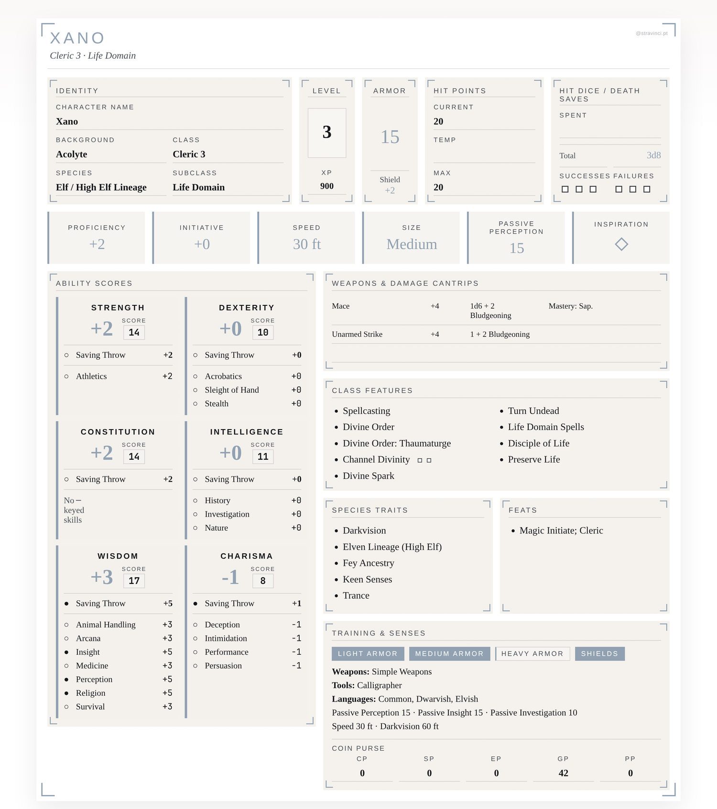
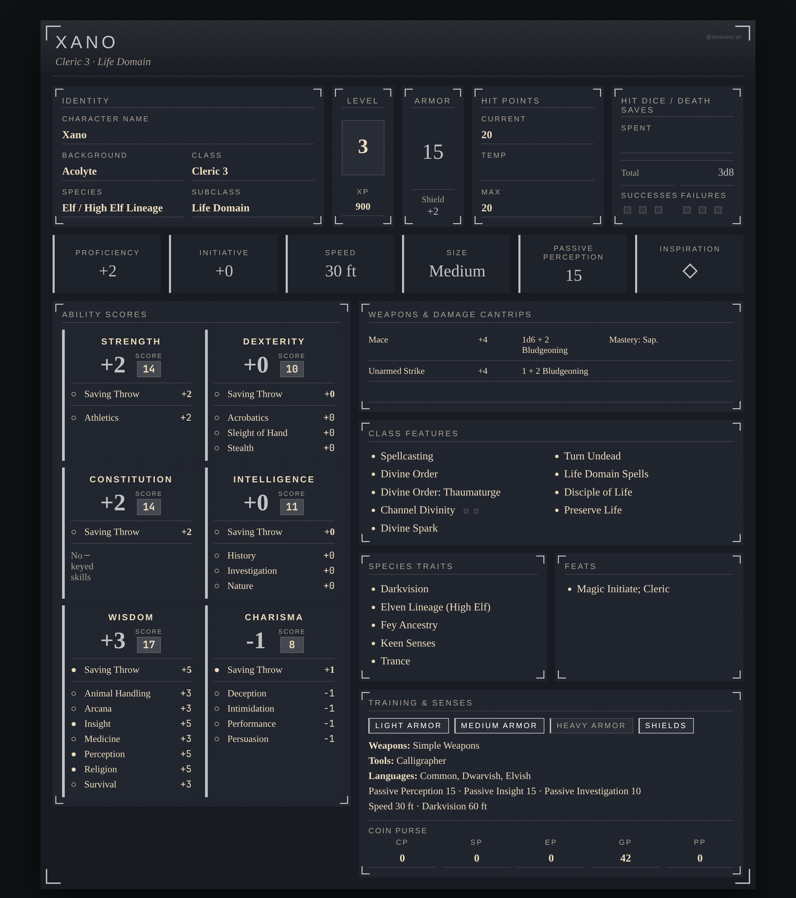
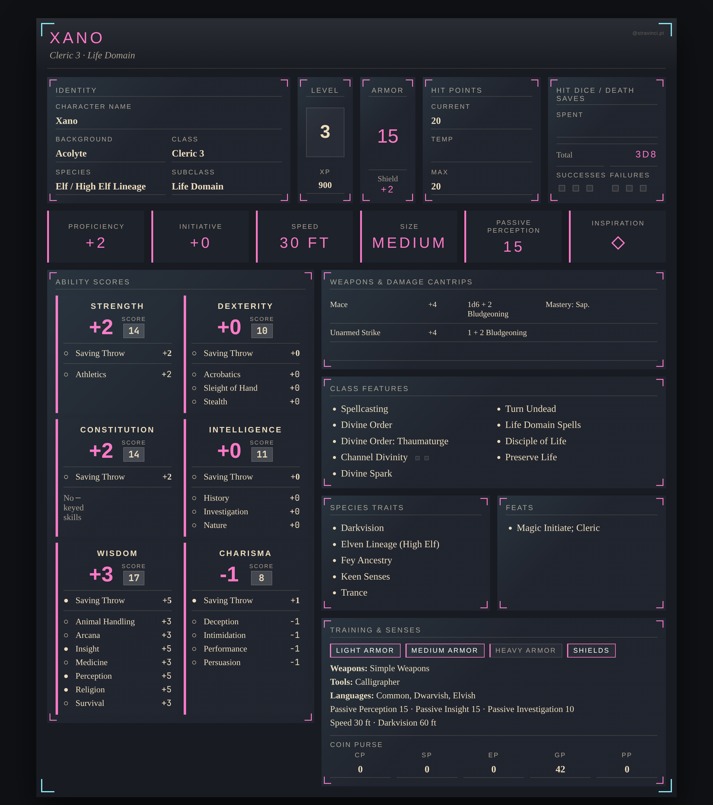
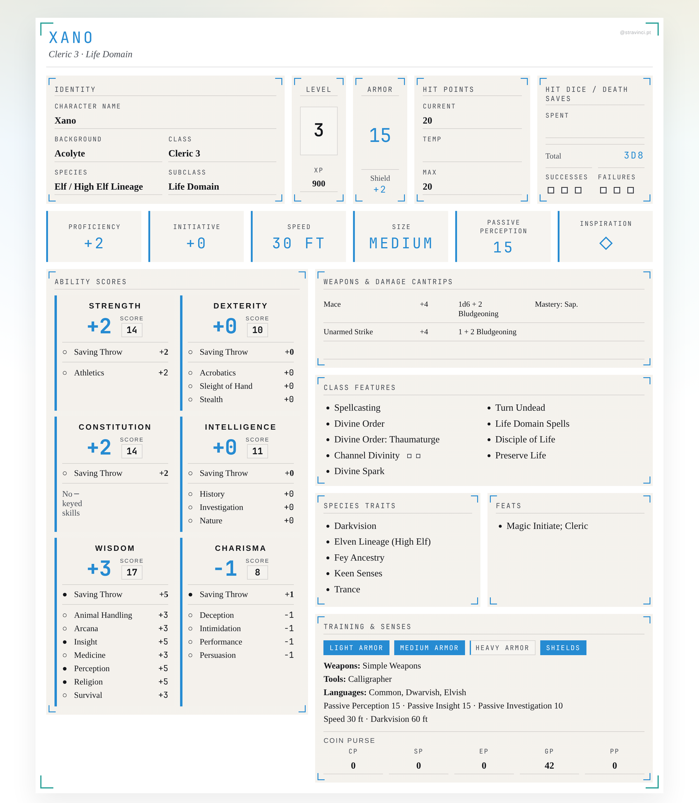
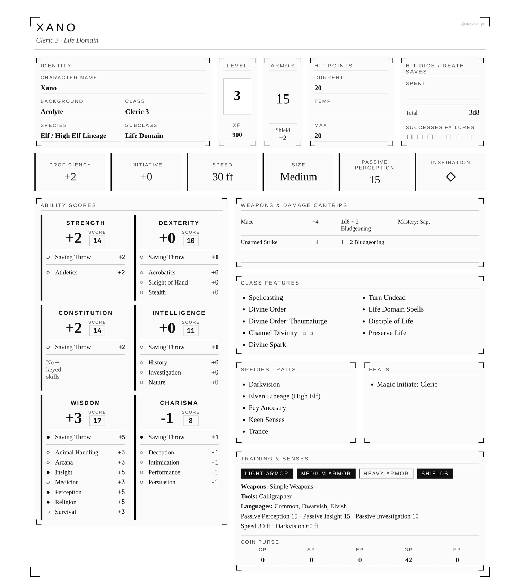
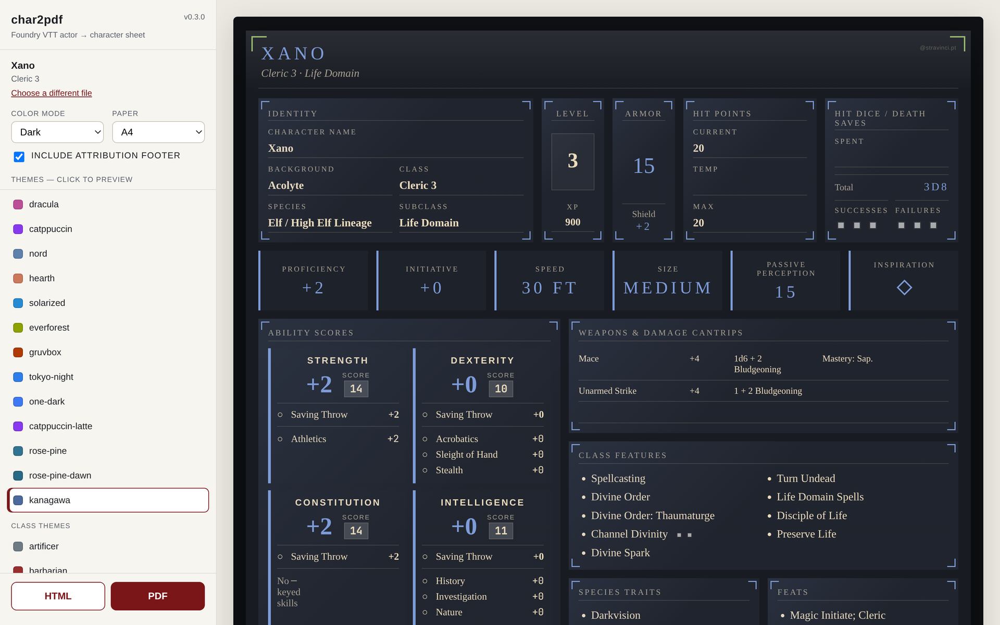

# foundryvtt-char2pdf

`foundryvtt-char2pdf` converts D&D 5e character exports into interactive HTML sheets and printable PDFs.

Current support is for Foundry's `dnd5e` system, including D&D 2024-style character data. It is character-agnostic within that system: if you feed it a different `dnd5e` actor export, it should generate a sheet for that character too.

It also reads and writes **Lion's Den "Fight Club 5e" / "Game Master 5" XML** (the format those mobile apps use). Fight Club characters are D&D 5e too, so they render through the same engine — every theme, color mode, paper size, and the web UI work identically — and any character can be converted back out to Fight Club XML with `--to-fightclub`. See [Fight Club 5e XML](#fight-club-5e-xml).

Current release: `v0.3.0`

## Screenshots

The same character — `Xano`, a level 3 Life Domain Cleric — rendered by the generator. Every sheet keeps a two-column, print-ready layout and ships with an in-browser `light` / `dark` / `mono` toggle.

<p align="center">
  <br>
  <sub>Auto-selected class theme (Cleric) · light</sub>
</p>

A few of the built-in themes and color modes:

<table>
  <tr>
    <td align="center" width="50%">
      <br>
      <sub>Class theme · dark</sub>
    </td>
    <td align="center" width="50%">
      <br>
      <sub>Dracula palette · dark</sub>
    </td>
  </tr>
  <tr>
    <td align="center" width="50%">
      <br>
      <sub>Solarized palette · light</sub>
    </td>
    <td align="center" width="50%">
      <br>
      <sub>Mono · tuned for grayscale printing</sub>
    </td>
  </tr>
</table>

## Themes

By default the generator picks a theme based on the actor's primary class. You can override with `--theme NAME` or pass a custom `#RRGGBB` accent.

- **Layouts** (typography + ornaments): `ledger`, `gazette`, `grimoire`.
- **Curated palettes** (ledger layout + bespoke decoration): `dracula`, `catppuccin` / `catppuccin-latte`, `nord`, `hearth`, `solarized`, `everforest` / `everforest-light`, `gruvbox` / `gruvbox-light`, `ayu-light` / `ayu-mirage`, `material`, `tokyo-night`, `one-dark`, `rose-pine` / `rose-pine-dawn`, `kanagawa`.
- **Class accents** (one per D&D class): `artificer`, `barbarian`, `bard`, `cleric`, `druid`, `fighter`, `monk`, `paladin`, `ranger`, `rogue`, `sorcerer`, `warlock`, `wizard`.

## Color modes

`--mode` sets the initial color mode of the generated HTML/PDF:

- `light` (default for layout/curated themes)
- `dark`
- `mono` — pure black-and-white, intended for grayscale printing

Every generated HTML sheet also includes an in-browser theme toggle that cycles `light` → `dark` → `mono` regardless of the initial mode.

## Requirements

- Python `3.10+`. Older Python versions are not supported because the generator uses modern type-hint syntax.
- No third-party Python packages; the generator uses only the Python standard library
- A Chromium-compatible browser for PDF export: Chromium, Google Chrome, Microsoft Edge, Brave, Vivaldi, Helium, or Arc

HTML generation works with vanilla Python alone. PDF generation additionally requires a local Chromium-compatible browser. The generator looks for common Linux commands plus standard macOS and Windows install paths for the browsers listed above, checking both the system-wide `/Applications` and a per-user `~/Applications` on macOS. If autodetection does not find your browser, pass it explicitly with `--print-browser /path/to/browser` or the legacy `--chromium /path/to/browser`. CI checks the minimum supported Python version, currently Python 3.10.

## Graphical interface (no command line)

<p align="center">
  <br>
  <sub>The local web UI — pick a theme from the sidebar and see a live preview before downloading</sub>
</p>

Prefer not to use the terminal? Launch the built-in web UI:

```bash
python3 generate_character_sheet.py --serve
```

This starts a small local server (bound to `127.0.0.1`, nothing exposed to your network) and opens your browser, where you can drop in an actor file, preview every theme live, choose color mode / paper / footer, and download the HTML (plus a PDF if a Chromium-compatible browser is installed). Your character data never leaves your machine. Use `--port N` or `--no-browser` to adjust. A Windows executable build is available below.

## Windows executable

Run the `Windows EXE` GitHub Actions workflow, download and unzip the `char2pdf-windows-exe` artifact, and double-click `char2pdf.exe`. It starts the same web UI as `--serve` and writes sheets to an `output/` folder beside the executable (PDF export still needs a Chromium-compatible browser installed). To build locally on Windows:

```bash
python -m pip install -r requirements-build.txt
python -m PyInstaller --noconfirm --clean char2pdf.spec
```

## Usage

```bash
python3 generate_character_sheet.py path/to/actor.json [options]
```

This writes an HTML sheet — themed to the actor's class — into `output/`. Common flags (see `--help` for the full list):

| Flag | Effect |
| --- | --- |
| `--pdf` | Also render a PDF (needs a local Chromium-compatible browser) |
| `--theme NAME\|#RRGGBB` | Pick a theme or custom accent (default: the actor's class) |
| `--mode light\|dark\|mono` | Initial color mode (`mono` is tuned for grayscale printing) |
| `--paper a4\|letter` | Page size (default: `a4`) |
| `--all-themes` | Render one HTML per registered theme |
| `--no-footer` | Omit the attribution/disclaimer footer |
| `--system dnd5e` | Force the game system instead of auto-detecting |
| `--print-browser PATH` | Use a specific browser for PDF export |
| `--output-dir DIR` | Where to write (default: `output/`) |

## Fight Club 5e XML

Besides Foundry JSON, the generator reads the XML that Lion's Den's **Fight Club 5e** and **Game Master 5** mobile apps export (a `<pc version="5">` document). Point the CLI or the web UI at the `.xml` file exactly as you would a Foundry export — it is detected automatically by file extension or content, converted into the same D&D 5e data model, and rendered by the identical engine:

```bash
python3 generate_character_sheet.py "path/to/My Character.xml" --pdf
```

In the web UI (`--serve`), drop the `.xml` file onto the same drop zone.

A few things do not survive the Fight Club format, because the export itself does not carry them:

- **Weapon attack rows.** Fight Club stores inventory as item names without damage dice, so weapons appear in your equipment list but the "Weapons & Damage Cantrips" block is not auto-filled.
- **Armor/weapon/language proficiency chips** and **subclass** are not encoded in a structured way and may show blank.
- **Ability scores from feats/ASIs.** Scores are reconstructed from the base array plus the export's ability modifiers. A few ASIs are stored without a target ability; those are applied to your class's spellcasting ability (the stat a caster usually maxes). Double-check the final scores against your app if a character took an unusual ASI.

### Exporting back to Fight Club

The reverse conversion is also available: `--to-fightclub` turns a Foundry (or already-imported) character into a Fight Club 5e XML file you can load into the mobile apps. It writes `<name>.xml` to the output directory instead of rendering a sheet:

```bash
python3 generate_character_sheet.py path/to/actor.json --to-fightclub
```

This is a best-effort conversion — the target format cannot represent everything:

- Final ability scores are written as the base scores with no racial/ASI modifiers, so the totals display correctly without double-counting.
- **Weapon damage** is not written (the format has no field for it), items are **not marked equipped**, and features are exported as plain-text entries.

Verify the imported character in the app before relying on it.

## Tests

Run the smoke tests with:

```bash
python3 -m unittest discover -s tests
```

## Notes

- Output filenames are derived from the actor name in the export.
- HTML sheets include editable trackers and notes stored in browser `localStorage`, and the PDF is rendered from that same HTML (opening the HTML and using Print produces the same layout).
- Exports do not always include every derived value, so the script computes core values such as proficiency bonus, skill bonuses, AC, initiative, and spell save DC from the actor data.

## Roadmap

Planned or wanted directions for the project. Contributions in any of these areas are welcome.

- **Polished desktop app packaging.** A basic Windows PyInstaller build exists; remaining work includes validating the artifact on Windows, adding icon/version metadata, deciding whether to ship macOS/Linux builds, and considering signing or installer packaging. Build-time tooling only — the generator runtime stays standard-library-only.
- **Cross-platform PDF parity.** Browser detection now covers Chrome, Edge, Chromium, Brave, Vivaldi, Helium, and Arc across Linux/macOS/Windows (including per-user `~/Applications` on macOS), and PDF export is validated on macOS. Remaining work is validating the Windows path on a real machine.
- **More curated palettes.** A daytime-leaning batch shipped (Gruvbox Light, Ayu Light/Mirage, Material, Everforest Light) on top of the existing set (Solarized, Gruvbox, Tokyo Night, Kanagawa, …). Further popular schemes and more dedicated light themes are still welcome.
- **More tabletop RPG systems.** A system-adapter boundary now separates system-specific schema/layout code from the shared framework (themes, color modes, paper profiles, PDF export, web UI). `dnd5e` is the first and currently only adapter. Adding another system (Pathfinder 2e, Call of Cthulhu, Shadowdark, etc.) means writing a new adapter — see [Adding a new game system](#adding-a-new-game-system).
- **More import/export formats.** Alongside Foundry JSON, the generator reads and writes Lion's Den Fight Club 5e / Game Master 5 XML (see [Fight Club 5e XML](#fight-club-5e-xml)). Both directions are intentionally lossy where the format omits data (weapon damage, some proficiencies, subclass, equipped state); tightening those gaps and adding further formats (D&D Beyond, other apps) is welcome.
- **Per-system print tuning.** A4 and US Letter profiles already ship; future work should tune page density and content priorities per game system.

## Contributing

Issues and pull requests are welcome.

- Open an issue first for anything non-trivial so the approach can be agreed before code is written.
- Keep the generator dependency-free: the Python side must run on the standard library only. Browser/PDF tooling is the only external runtime requirement.
- Match the existing code style. Small, focused PRs are easier to review than sweeping changes.
- When fixing a rendering bug, include a sanitized actor JSON (or a minimal repro) that triggers it.
- Do not commit private actor exports, generated `output/`, or third-party copyrighted artwork.
- New themes should add an entry to `THEMES` in `generate_character_sheet.py` and follow the existing `light_accent` / `dark_accent` pattern.
- New TTRPG-system support should live behind the system-adapter boundary so the existing `dnd5e` path is not regressed. See [Adding a new game system](#adding-a-new-game-system).

## Adding a new game system

A small **system-adapter boundary** in `systems.py` detects which system an actor export came from and routes it to the adapter that handles it, without itself knowing any specific system. A system adapter is any object satisfying the `systems.SystemAdapter` protocol:

| Member | Responsibility |
| --- | --- |
| `system_id: str` | The Foundry `systemId` this adapter handles (e.g. `"dnd5e"`). Used for auto-detection and the `--system` flag, so it must match Foundry's real id. |
| `display_name: str` | Human-readable name for messages and docs. |
| `matches(actor) -> bool` | Recognize the actor's schema shape. Called only when the export carries no usable `_stats.systemId` hint. |
| `build_context(actor) -> dict` | Parse the raw actor export into a render-ready context dict. |
| `default_theme(actor) -> str \| None` | The theme to use when the caller did not request one. |
| `render(context, sheet_id, *, style, initial_theme, theme_palette, palette_decoration, include_footer, paper) -> str` | Render one themed sheet (a full HTML document). |

Everything else is **shared framework that every adapter inherits for free**: the `THEMES` registry and palettes, the color modes, the paper profiles, PDF export, browser detection, the web UI, and the `localStorage` trackers.

To add a system: implement the protocol (the `dnd5e` `Dnd5eAdapter` in `generate_character_sheet.py` is the reference), then `systems.register(YourAdapter())` at import time. Detection is then automatic via `_stats.systemId` or your `matches()`; unsupported exports raise a clear `UnsupportedSystemError` naming the detected system.
